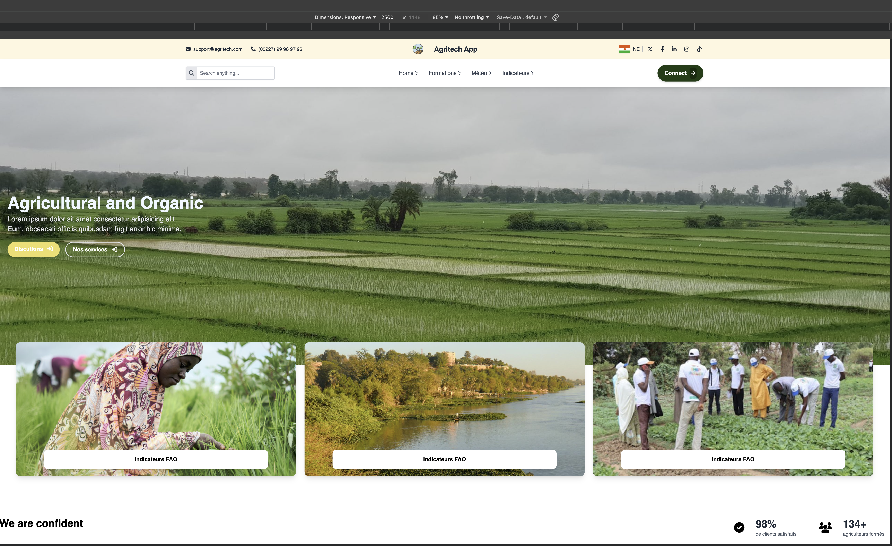
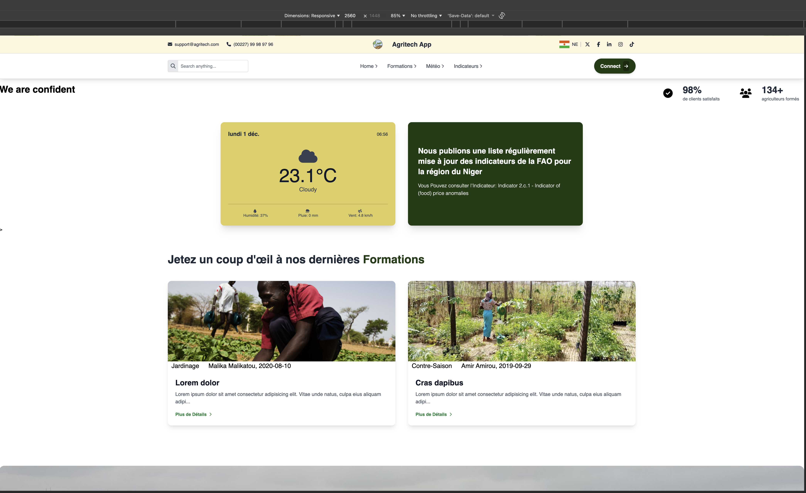
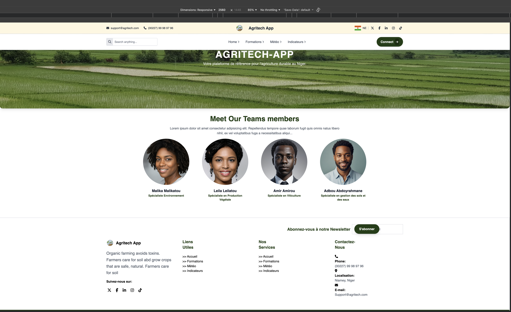
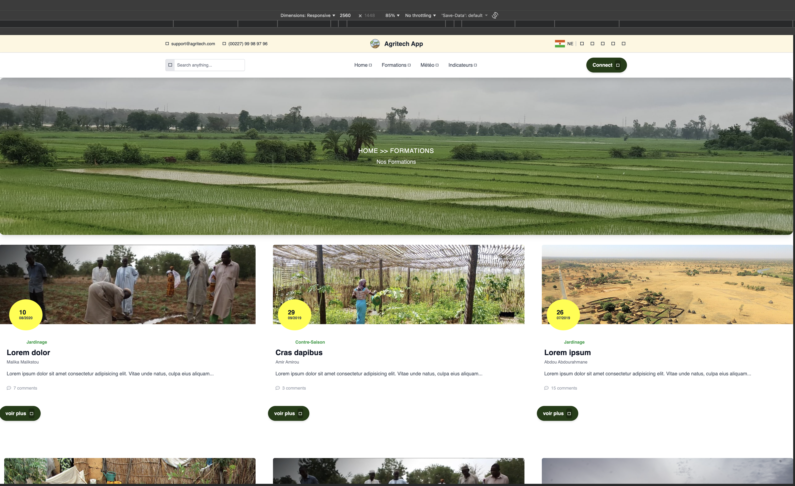
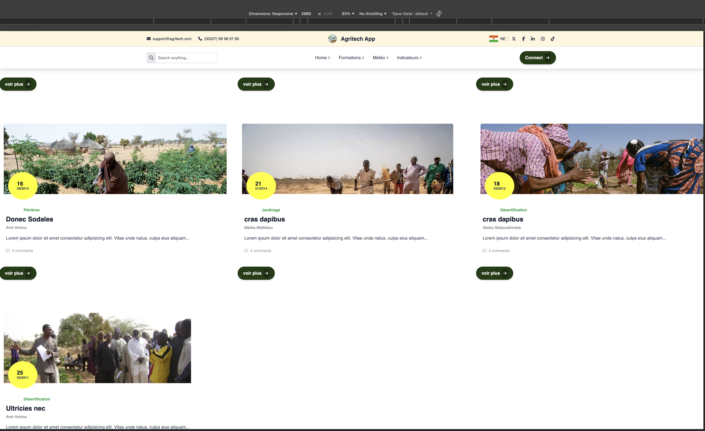
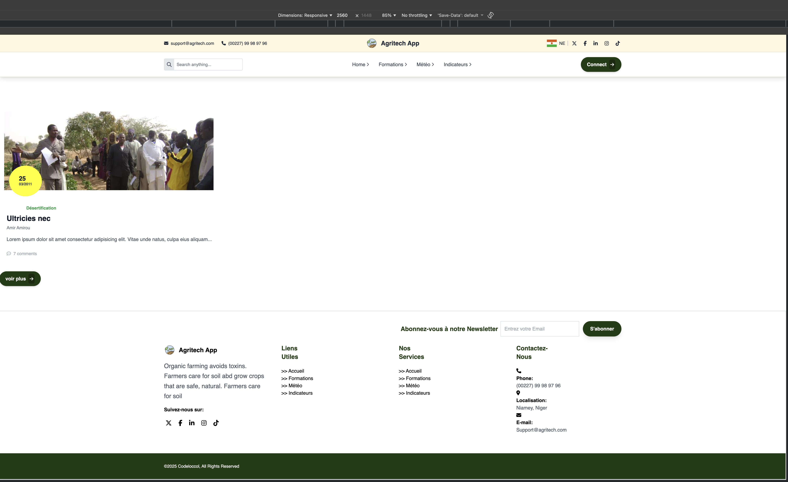
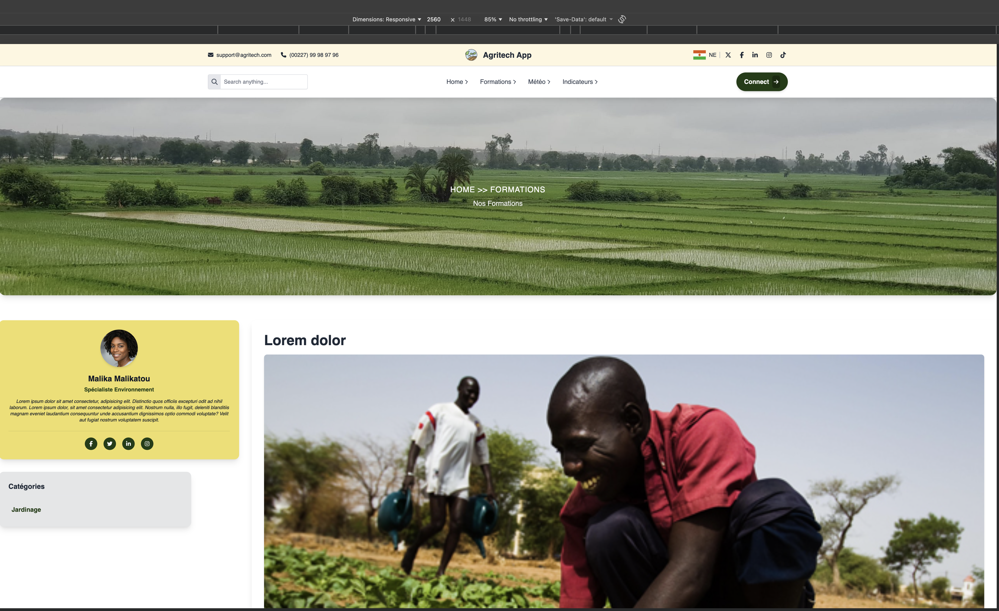

Projet Web Simulant une Plateforme de Formation Agricole
## Description
Ce projet consiste à concevoir un site web complet simulant une plateforme agricole proposant des formations aux agriculteurs.
Il a pour objectif de reproduire un environnement professionnel tout en vous familiarisant avec l’utilisation des frameworks CSS modernes (Tailwind, Bootstrap, Bulma, etc.).
Toutes les ressources visuelles (images, vidéos, designs) sont disponibles dans le lien Google Drive fourni dans la section Ressources supplémentaires du cours.
## Objectifs pédagogiques
*  Concevoir un projet web réaliste, structuré et cohérent
* Maîtriser l'utilisation des frameworks CSS les plus courants
* Appliquer des classes utilitaires pour construire rapidement des interfaces modernes
* Comprendre comment intégrer des composants réutilisables
* Apprendre à organiser un projet web complet
##  Spécifications du projet
* Contraintes techniques
Au minimum 80% des classes CSS utilisées doivent provenir du ou des frameworks CSS choisis.
Utilisation recommandée de classes utilitaires (ex : flex, grid, text-center, p-4, etc.).

## capture d'ecran

[apercu](./resultat/imag8.png)
[apercu](./resultat/imag9.png)

